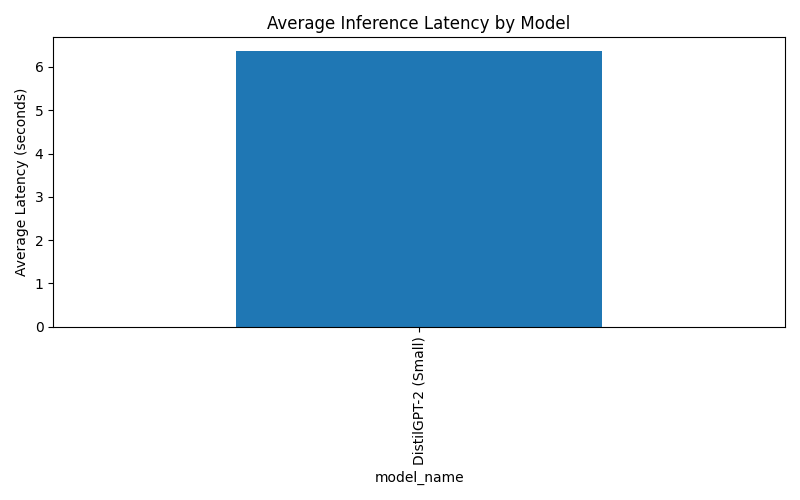

# LLM Performance Benchmarking Tool

A **production-quality, configuration-driven command-line benchmarking tool** for evaluating and comparing the performance of Large Language Models (LLMs).

This project helps engineers and ML practitioners make **informed model selection decisions** by systematically analyzing trade-offs between **latency, throughput, memory usage, and basic output quality** before deploying models to production.

---

## Project Objective

Selecting the right LLM for production is **not only about output quality**. Real-world systems must balance:

- Inference latency
- Hardware resource usage (CPU / GPU / RAM)
- Scalability constraints
- Deployment cost and feasibility

This tool provides a **systematic, reproducible, and automated way** to benchmark multiple LLMs and generate **clear, actionable performance reports**.

---

## Key Features

- Installable CLI tool (`llm-bench`)
- Supports Hugging Face LLMs
- Fully configuration-driven (YAML-based)
- Measures:
  - Inference latency
  - Tokens per second (throughput)
  - Peak RAM usage
  - Peak GPU memory usage (if available)
- Basic automated quality metrics:
  - Output length
  - Vocabulary diversity
- CSV result export
- Performance visualizations (PNG)
- Timestamped benchmark runs with `latest/` pointer
- Robust error handling (partial failures do not crash runs)
- Environment metadata capture (OS, Python version, hardware)
- Fully tested using PyTest
- CI pipeline via GitHub Actions

---

## What This Tool Benchmarks

For each model and prompt, the following metrics are recorded:

| Category        | Metrics                             |
| --------------- | ----------------------------------- |
| Performance     | Latency (seconds), Tokens/sec       |
| Memory          | Peak RAM (MB), Peak GPU memory (MB) |
| Quality (basic) | Output length, Vocabulary diversity |

---

## Project Structure

```
## Project Structure

llm-performance-benchmark/
├── README.md
├── requirements.txt
├── setup.py
├── pyproject.toml
│
├── .github/workflows/
│   └── ci.yml
│
├── config/
│   ├── benchmark.yaml        # Model, dataset, and benchmark configuration
│   ├── prompts.jsonl         # Benchmark prompts
│   └── schema.yaml           # Config validation schema
│
├── src/
│   ├── cli.py                # CLI entry point
│   └── benchmark/
│       ├── runner.py         # Benchmark orchestration logic
│       ├── models.py         # Model loading and inference wrappers
│       ├── metrics.py        # Performance and quality metrics
│       ├── monitor.py        # RAM / GPU monitoring
│       ├── reporter.py       # CSV + visualization generation
│       ├── environment.py    # System metadata capture
│       ├── logging_utils.py  # Structured logging utilities
│       └── exceptions.py     # Custom exception handling
│
├── tests/
│   ├── test_cli.py
│   ├── test_metrics.py
│   ├── test_monitor.py
│   └── test_runner.py
│
├── outputs/                  # gitignored (runtime artifacts)
│   ├── <timestamp>/
│   └── latest/
│
└── docs/
    ├── benchmark_report.md
    ├── design_decisions.md
    ├── sample_results.csv
    ├── latency_comparison.png
    └── memory_comparison.png

```

---

## Setup Instructions

### 1️.Clone the repository

```bash
git clone https://github.com/rakeshchinni77/llm-performance-benchmark.git
cd llm-performance-benchmark

```

### 2️.Create and activate virtual environment

```bash
python -m venv .venv

```

Windows

```bash
.venv\Scripts\Activate.ps1
```

Linux / macOS

```bash
source .venv/bin/activate
```

### 3️.Install dependencies

```bash
pip install -r requirements.txt
pip install -e .
```

---

## How to Run the Benchmark

The tool is executed via the CLI and controlled using a YAML configuration file.

```bash

python -m src.cli run --config config/benchmark.yaml

```

---

## Configuration Overview (`benchmark.yaml`)

The configuration file defines:

- Models to benchmark
- Prompt dataset
- Text generation parameters
- Runtime device (CPU / GPU)
- Output and logging behavior

### Example (simplified)

models:

- id: "distilgpt2"
  name: "DistilGPT-2 (Small)"
  provider: "huggingface"
  size: "<1B"
  dtype: "float32"

dataset:
path: "config/prompts.jsonl"
format: "jsonl"
text_field: "prompt"

runtime:
device: "cpu"

The configuration is validated against a **JSON schema** before execution to prevent runtime errors.

---

## Output Artifacts

Each benchmark run produces a timestamped directory:

outputs/<YYYY-MM-DD_HHMM>/

A convenience pointer is also maintained:

outputs/latest/

### Generated Artifacts

- results.csv
- latency_comparison.png
- memory_comparison.png
- environment.json
- summary.md
- logs/benchmark.log

**Note:** `outputs/` is gitignored.  
Sample artifacts are copied into `docs/` for review.

---

## Sample Visualizations

The following charts were generated from a real benchmark run and are included
in the `docs/` directory for reviewer inspection.

### 🔹 Average Inference Latency per Model
This chart compares the average end-to-end inference latency across models.



---

### 🔹 Peak Memory Usage per Model
This chart shows the average peak RAM usage during inference.


---

## Testing

All major components are unit tested.

Run tests locally:

pytest -v

---

## Continuous Integration (CI)

A GitHub Actions workflow automatically:

- Sets up Python 3.11
- Installs dependencies
- Runs all PyTest test cases

CI executes on every push and pull request to `main`.

---

## Design Principles

- **Modularity** – clear separation of concerns
- **Configuration-driven** – no hardcoded models or paths
- **Fail-safe execution** – partial failures do not stop the benchmark
- **Production mindset** – realistic metrics and reporting
- **Reproducibility** – environment metadata captured

Detailed rationale is available in:  
`docs/design_decisions.md`

---

## Benchmark Analysis

A detailed interpretation of the benchmark results is provided in:  
`docs/benchmark_report.md`

---

## Future Enhancements

- Perplexity-based quality metrics
- Batch inference benchmarking
- Multi-GPU benchmarking
- Cloud-hosted model evaluation
- API endpoint benchmarking

---

## License

This project is released under the **MIT License**.
